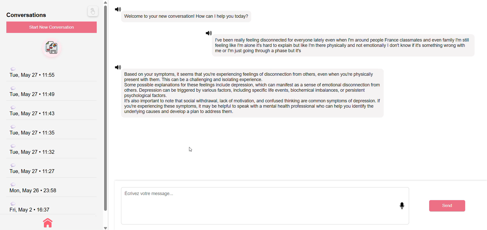

# MoodMate Project

Welcome to **MoodMate**, an intelligent emotion-aware chatbot and mood tracking assistant.

This repository contains information about both the **Frontend** and the **Backend** parts of MoodMate.

---

## 🖥️ Frontend

The **MoodMate Frontend** is the user interface that allows users to:

- Chat with an AI-powered emotion-aware chatbot  
- Visualize emotional trends over time  
- Use voice recognition and text-to-speech features  
- Enjoy a responsive design for all devices

### 🌟 Frontend Features

- Real-time chat interface  
- Emotion detection on user inputs  
- Weekly emotion dashboard (bar chart, line chart, satisfaction gauge)  
- Speech-to-text (voice recognition)  
- Text-to-speech for bot responses  

### 🖼️ Screenshots

#### Home Page  

#### Chat Interface  

#### Emotion Dashboard  

---

## ⚙️ Backend

The **MoodMate Backend** provides:

- Emotion recognition model inference  
- REST API for chatbot interaction and data management  
- Model files required for emotion detection

### ⚠️ Important: Backend Repository & Model Files

The backend code and the large **emotion detection model files are hosted in a separate GitHub repository**.

To run the full MoodMate app, you **must:**

1. Clone the backend repository from GitHub:  
https://github.com/AmalDhouib/Backend_MoodMate.git
